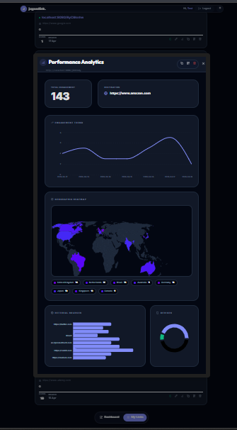
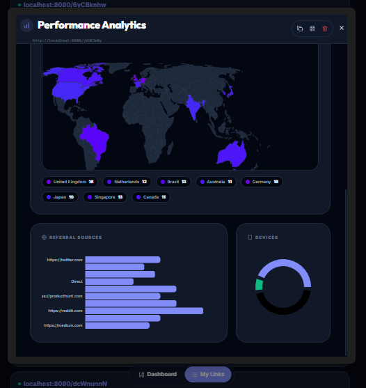
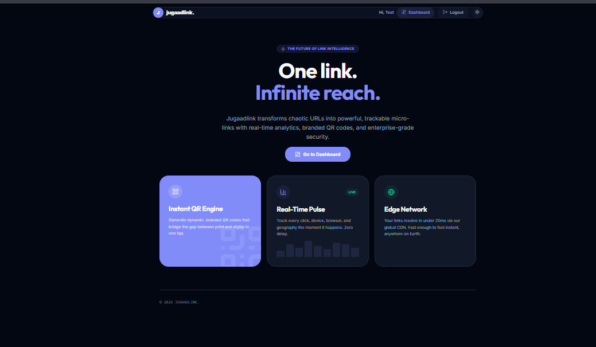
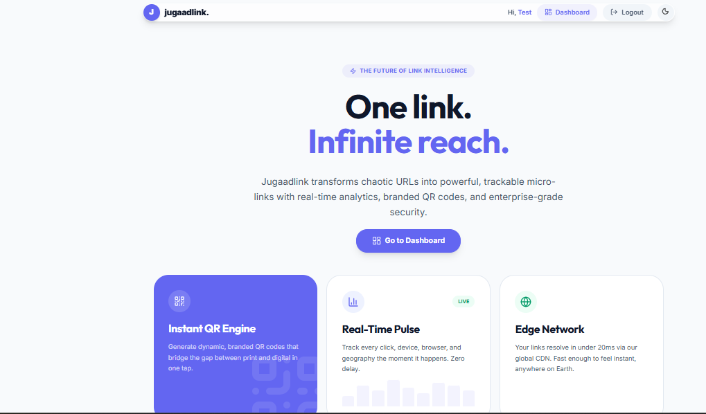
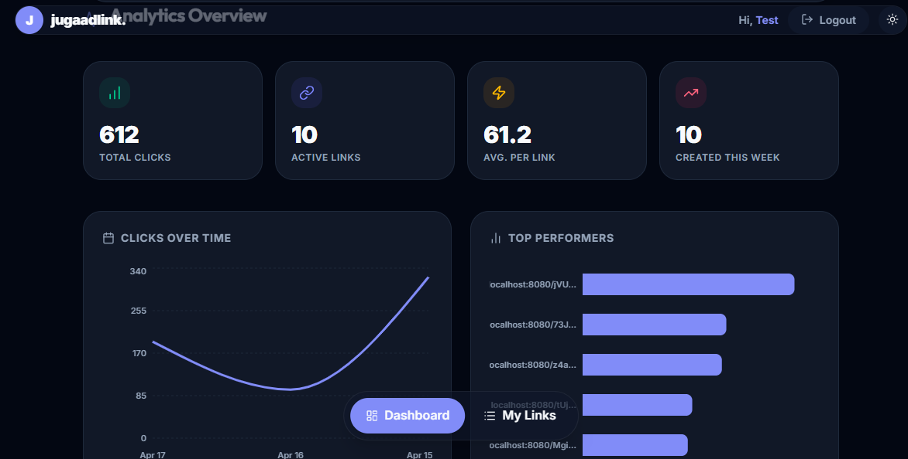

# JugaadLink Frontend

**URL shortener interface built with Next.js, React Query, and Ant Design.**

[](https://nextjs.org)
[](https://react.dev)
[](https://typescriptlang.org)
[](https://ant.design)
[](LICENSE)

JugaadLink is a full-featured URL management dashboard. It lets users shorten links, set passwords and expiration rules, organize links by category, and view per-link and dashboard-wide analytics including a geographic heatmap.

## Preview

| Landing Page | Dashboard (My Links) |
| :---: | :---: |
|  |  |

| Analytics Overview | Link Analytics (Details) |
| :---: | :---: |
|  |  |

| Login Page |
| :---: |
|  |

## Table of Contents

- [Features](#features)
- [Tech Stack](#tech-stack)
- [Project Structure](#project-structure)
- [Getting Started](#getting-started)
- [Environment Variables](#environment-variables)
- [Scripts](#scripts)
- [Pages and Routes](#pages-and-routes)
- [Architecture Notes](#architecture-notes)
- [Contributing](#contributing)

## Features

| Feature | Description |
| :--- | :--- |
| URL Shortening | Paste any URL and receive a short link in under 200 ms |
| Custom Alias | Choose your own short code (3 to 20 characters) |
| Password Protection | Lock a link behind a password with a dedicated unlock page |
| Link Expiry | Set a date-based or click-count-based limit per link |
| Link Editing | Update password, expiry, max clicks, tags, category, and notes after creation |
| Category Directory | History tab groups links by category into collapsible folder sections |
| Link Toggle | Enable or disable any link; disabled links redirect to a friendly error page |
| Real-time Analytics | Per-link and aggregate stats: clicks, devices, browsers, OS, referrers |
| Geographic Heatmap | Interactive world map showing click distribution by country |
| QR Code Generation | One-click QR code download for any link |
| Tags and Notes | Attach tags, a category, and a comment note to every link |
| Guest Mode | Full link creation without an account using session tokens |
| Dark and Light Mode | CSS variable-based theme system with glassmorphic dark mode |
| SEO Ready | Open Graph, Twitter Cards, canonical URLs, robots.txt, and structured metadata |

## Tech Stack

| Layer | Technology |
| :--- | :--- |
| Framework | Next.js 16 (App Router) |
| Language | TypeScript 5 |
| UI Components | Ant Design 6 |
| Styling | Custom CSS design system with CSS custom properties |
| Data Fetching | TanStack React Query v5 |
| HTTP Client | Axios |
| Charts | Recharts |
| World Map | react-simple-maps with world-atlas TopoJSON |
| Icons | Lucide React |
| QR Codes | qrcode.react |
| Animations | GSAP |
| Backend | Go, Gin, GORM, PostgreSQL, Redis |

## Project Structure

```
url-shortener-fe/
├── app/
│   ├── components/
│   │   ├── common/          # Shared design system: Button, Card, Modal, Input, Map
│   │   ├── Auth/            # Login and Register forms
│   │   ├── Dashboard/       # Shortener form, link list, analytics, edit modal
│   │   ├── LandingPage/     # Public landing page sections
│   │   └── Layout/          # Navbar and page layout wrappers
│   ├── constants/           # Centralized UI strings, API endpoints, route paths
│   ├── Services/            # Axios client, service functions, React Query hooks
│   ├── types/               # Global TypeScript declarations
│   ├── dashboard/           # /dashboard route page
│   ├── login/               # /login route page
│   ├── signup/              # /signup route page
│   ├── password/[code]/     # Password entry page for protected links
│   ├── link-disabled/       # Disabled or expired link error page
│   ├── layout.tsx           # Root layout with metadata and providers
│   └── globals.css          # Design tokens and global styles
├── styles/                  # Additional global stylesheets
├── public/
│   └── robots.txt           # Crawler directives
├── next.config.ts           # Next.js configuration
└── package.json
```

## Getting Started

### Prerequisites

- Node.js 18 or higher
- npm, yarn, or pnpm
- The JugaadLink backend running (see [jugaadlink-be](../Url%20shortener-be/README.md))

### Installation

```bash
git clone https://github.com/your-username/jugaadlink.git
cd jugaadlink/url-shortener-fe

npm install
```

### Development Server

```bash
npm run dev
```

Open [http://localhost:3000](http://localhost:3000) in your browser.

The app expects the backend API at `http://localhost:8080` by default. Configure this via `.env` before starting.

## Environment Variables

Create a `.env` file in the project root:

```env
# Base URL for authenticated API calls (includes /api/v1 prefix)
NEXT_PUBLIC_BASE_URL=http://localhost:8080/api/v1

# Base server URL for public API calls (redirect, verify-password)
NEXT_PUBLIC_SERVER_URL=http://localhost:8080
```

| Variable | Description |
| :--- | :--- |
| `NEXT_PUBLIC_BASE_URL` | Full base URL for all authenticated REST calls |
| `NEXT_PUBLIC_SERVER_URL` | Root server URL used by public endpoints such as password verification |

## Scripts

| Command | Description |
| :--- | :--- |
| `npm run dev` | Start the development server |
| `npm run build` | Compile a production build |
| `npm run start` | Serve the compiled production build |
| `npm run lint` | Run ESLint across the project |

## Pages and Routes

| Route | Description |
| :--- | :--- |
| `/` | Public landing page |
| `/dashboard` | Main application: shortener form, link history, analytics |
| `/login` | User login |
| `/signup` | User registration |
| `/password/[code]` | Password entry page for protected links |
| `/link-disabled` | Shown when a link is deactivated, expired, or has reached its click limit |

## Architecture Notes

**API Client**: Two Axios instances are used. `api` (in `Services/apiClient.ts`) handles all authenticated calls and automatically attaches the JWT or session token. `publicApi` handles unauthenticated calls such as password verification and redirects. Both instances have response interceptors that unwrap the `data` envelope returned by the backend.

**React Query**: All server state is managed with TanStack React Query. Queries and mutations are defined in `Services/useUrlShortener.ts` and `Services/useAuth.ts`. Mutation hooks accept an optional `mutationConfig` object for per-call `onSuccess` and `onError` handlers.

**Design System**: All UI tokens (colors, spacing, typography, shadows) are defined as CSS custom properties on `:root` in `globals.css`. Ant Design components are customized through a theme config at the provider level in `layout.tsx`.

**Constants**: All hard-coded strings, API endpoint paths, route paths, and display labels live in `app/constants/`. Nothing is hard-coded in components.

**Category Directory**: The history tab groups links by their `category` field using `useMemo`. Each group is rendered as a collapsible folder section. Links with no category appear in an Uncategorized group at the bottom.

## Contributing

Contributions are welcome. Please open an issue before submitting a pull request for any significant change.

1. Fork the repository.
2. Create a feature branch: `git checkout -b feature/your-feature`.
3. Make your changes and ensure `npm run lint` passes.
4. Push and open a pull request against `main`.

